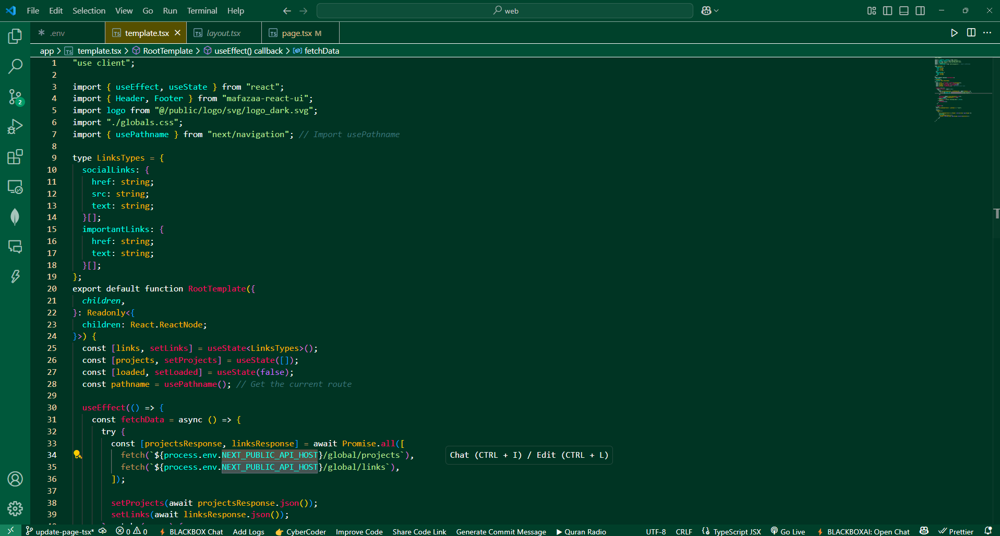
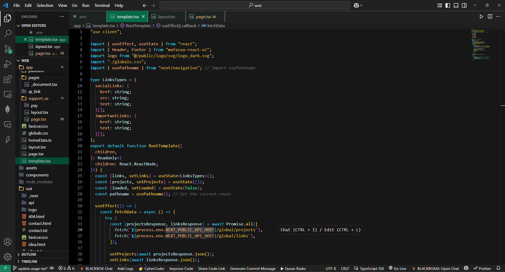

# YM-themes for Visual Studio Code

## Light Mode ☀️🌄

## Dark Mode 🌙🌃

### A modern clean themes for Visual Studio Code.
### *Installation* All instructions can be found at [ Green-leaf](https://github.com/YM1prg/Ym_grean-leaf).

This theme is maintained by the following person and a bunch of awesome contributors.
YM
 *Contributors* yahya mohmed

Contributing
If you'd like to contribute to this theme, please read the contributing guidelines:
Here's a **GitHub Contribution Guide** [ CONTRIBUTING](https://github.com/YM1prg/Ym_grean-leaf/blob/main/Contributing.md). for your VS Code theme extension. This will help contributors understand how to contribute, report issues, and improve the project.  

---

License
MIT License
